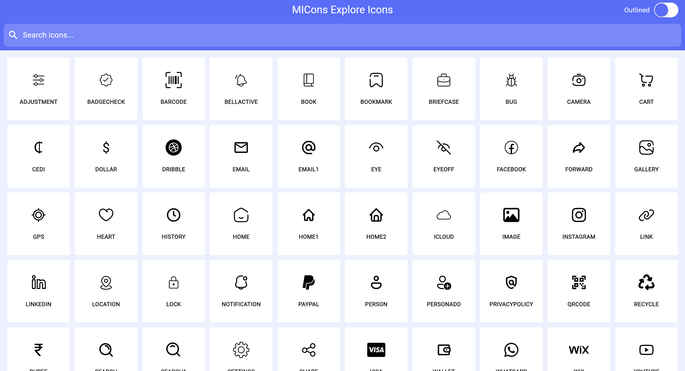

# M-Icons

M-Icons is a free icon pack for Flutter applications, providing a wide range of high-quality icons to enhance your Flutter projects. Our icons are designed to be simple, scalable, and adaptable to any application theme.


## Package Installation 

To use M-Icons in your Flutter project, add the package to your `pubspec.yaml` file:

```yaml
dependencies:
  flutter:
    sdk: flutter
  micons: ^0.0.2
```

or run this command:

```bash
flutter pub add micons
```

[Search Icons](https://main--micons.netlify.app/).



## Usage

After installation, you can start using the icons in your Flutter application. Here is a simple example of how to use an icon from M-Icons using the MIcons widget:

```dart
import 'package:flutter/material.dart';
import 'package:m_icons/m_icons.dart';

class MyWidget extends StatelessWidget {
  @override
  Widget build(BuildContext context) {
    return MIcons(
      icon: MiCons.badgeCheck, // Use the icon you need from MIcons
      color: Colors.black, // Icon color
      size: 80, // Icon size
      filled: true, // Filled style if available
    );
  }
}
```

In this example, MiCons.badgeCheck is the icon being used, but you can replace MiCons.badgeCheck with any icon name from the M-Icons pack that suits your needs.

## File Uploader

M-Icons also provides a convenient file uploader feature that allows you to easily upload files to your desired location. Below is an example of how to use the file uploader:

## Upload

```dart
MIconsUploader.uploadFiles(
  files: files,
  apiKey: "API_KEY",
  folder: "FOLDER_NAME",
).listen(
  (progress) {
    log("Progress for ${progress.fileKey} is ${progress.progress * 100}%");
    if (progress.url != null) {
      uploadedUrls[progress.fileKey] = progress.url!;
    }
    if (progress.urls != null) {
      uploadedUrls = progress.urls!;
    }
  },
  onDone: () {
    log("All files uploaded. URLs:");
    uploadedUrls.forEach((key, url) {
      log("File key: $key, URL: $url");
    });
  },
  onError: (error) {
    log('Error in upload stream: $error');
  },
);
```
## Upload Example

```dart
import 'dart:io';
import 'package:flutter/material.dart';
import 'package:image_picker/image_picker.dart';
import 'package:m_icons/m_icons_uploader.dart';

class FileUploaderWidget extends StatefulWidget {
  @override
  _FileUploaderWidgetState createState() => _FileUploaderWidgetState();
}

class _FileUploaderWidgetState extends State<FileUploaderWidget> {
  Map<String, File> files = {};
  Map<String, String> uploadedUrls = {};

  void imagePicker() async {
    ImagePicker picker = ImagePicker();
    final XFile? image = await picker.pickImage(source: ImageSource.gallery);
    if (image != null) {
      files["image"] = File(image.path);
      MIconsUploader.uploadFiles(
        files: files,
        apiKey: "API_KEY",
        folder: "FOLDER_NAME",
      ).listen(
        (progress) {
          log("Progress for ${progress.fileKey} is ${progress.progress * 100}%");
          if (progress.url != null) {
            uploadedUrls[progress.fileKey] = progress.url!;
          }
          if (progress.urls != null) {
            uploadedUrls = progress.urls!;
          }
        },
        onDone: () {
          log("All files uploaded. URLs:");
          uploadedUrls.forEach((key, url) {
            log("File key: $key, URL: $url");
          });
        },
        onError: (error) {
          log('Error in upload stream: $error');
        },
      );
    }
  }

  @override
  Widget build(BuildContext context) {
    return Column(
      children: [
        ElevatedButton(
          onPressed: imagePicker,
          child: Text('Upload Image'),
        ),
        // Display uploaded URLs or progress here
      ],
    );
  }
}
```
In this example, the imagePicker method uses the image_picker package to select an image from the gallery and the MIconsUploader.uploadFiles method to upload the selected file. The upload progress and URLs are logged for your reference.

## Contributing

We welcome contributions to M-Icons! If you have suggestions for new icons or improvements, please open an issue or submit a pull request on our [GitHub repository](https://github.com/mushthakvp/micons).


This README file includes the sections for installation, usage of icons, the file uploader feature, and contributing information.
